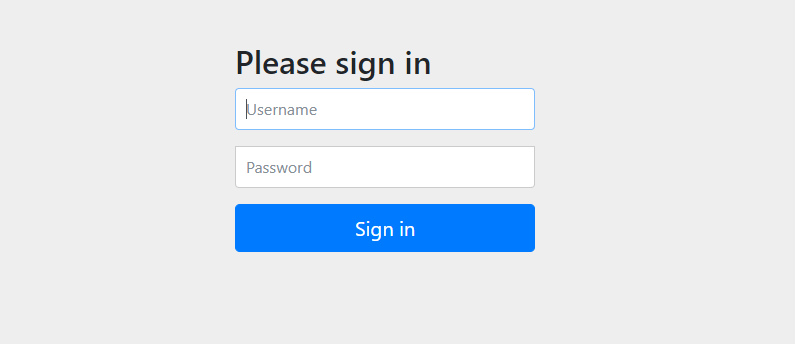
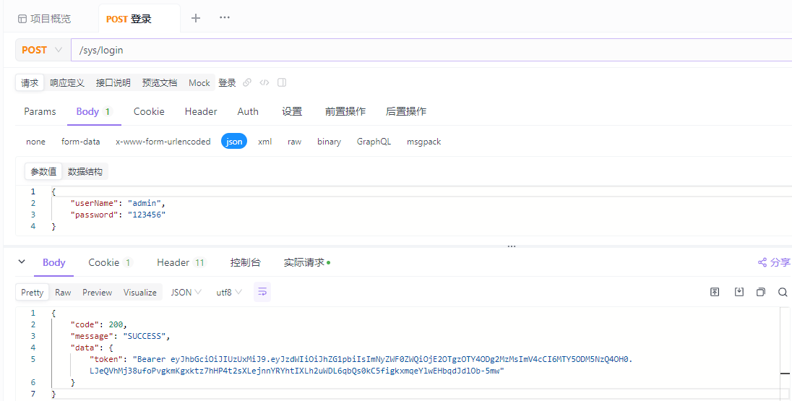
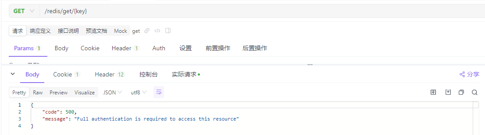
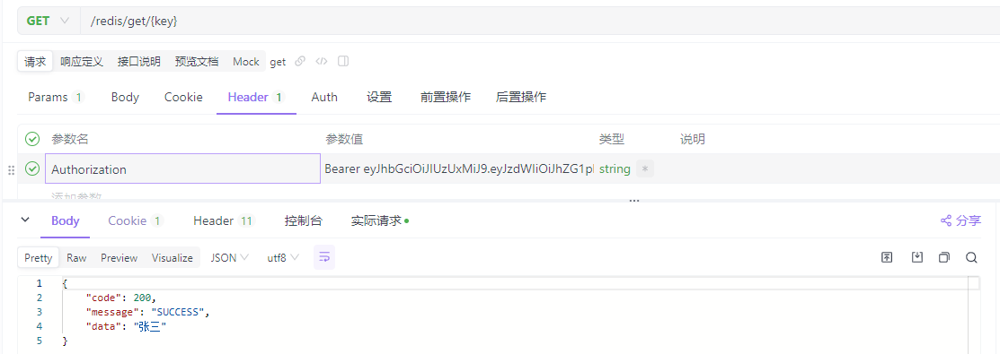

# Spring Security + Jwt 登录实现
> 💡 ps：如果有问题请麻烦指正下，感谢！！！


Spring Security是一个提供[身份验证](https://docs.spring.io/spring-security/reference/features/authentication/index.html)、[授权](https://docs.spring.io/spring-security/reference/features/authorization/index.html)和[针对常见攻击的保护](https://docs.spring.io/spring-security/reference/features/exploits/index.html)的框架。 凭借对[保护命令式](https://docs.spring.io/spring-security/reference/servlet/index.html)和[反应](https://docs.spring.io/spring-security/reference/reactive/index.html)式应用程序的一流支持，它是保护基于 Spring 的应用程序的事实标准。

## 技术栈

- Java 17
- [SpringBoot](https://spring.io/projects/spring-boot)  `3.1.5`
- [Security](https://spring.io/projects/spring-security)  `6.1.5`
- [Jwt](https://jwt.io/introduction)  `0.9.1`

登录访问由 Spring Security 和 Jwt 完成，用户权限通过角色实现。
## 初始
> 💡 Tips：通过下载由 [Spring Initializr](https://start.spring.io/starter.zip?type=maven-project&language=java&packaging=jar&jvmVersion=1.8&groupId=example&artifactId=hello-security&name=hello-security&description=Hello%20Security&packageName=example.hello-security&dependencies=web,security) 准备的最小 SpringBoot+SpringSecurity 应用程序

```xml
<dependency>
    <groupId>org.springframework.boot</groupId>
    <artifactId>spring-boot-starter-security</artifactId>
</dependency>
```
新建一个控制类验证请求登录拦截
```java
@RestController
public class HelloController {

    @GetMapping("/hello")
    public String sayHello() {
        return "Hello World";
    }
}
```
选中 HelloSecurityApplication.java 启动应用程序控制台会打印对应 password `例如: Using generated security password: 55bcf6ab-f685-4a53-8102-8549aa1e2199`执行访问 localhost:8080/hello


输入对应输入值进行访问，用户名默认为 `user`，密码为上述生成。

## Security + Jwt 实现账号密码登录验证
```xml
<dependency>
    <groupId>io.jsonwebtoken</groupId>
    <artifactId>jjwt</artifactId>
    <version>0.9.1</version>
</dependency>
```

### 用到的 security 类
* AbstractAuthenticationToken 身份验证基类
  * UsernamePasswordAuthenticationToken 用户名和密码验证
* AuthenticationManager 认证相关的核心接口 
* Authentication 封装用户的验证请求信息

### 实现流程

1. 新建 [SecurityFilterChain]() 实例，使用 SecurityFilterChain 来确定应为当前请求调用哪些Spring Security 实例。其中可以配置各种 Fileter 这些过滤器可用于许多不同的目的，例如[身份验证](https://docs.spring.io/spring-security/reference/servlet/authentication/index.html)、[授权](https://docs.spring.io/spring-security/reference/servlet/authorization/index.html)、[漏洞利用保护](https://docs.spring.io/spring-security/reference/servlet/exploits/index.html)等。 筛选器按特定顺序执行，以确保在正确的时间调用它们，例如，应在执行授权之前调用执行身份验证的 。 
2. 新建自定义 Filter 过滤器添加到 SecurityFilterChain 过滤器链中下述代码中扩展了 [OncePerRequestFilter](https://docs.spring.io/spring-framework/docs/6.0.13/javadoc-api/org/springframework/web/filter/OncePerRequestFilter.html) 保证每个请求执行一次的筛选器基类调度。主要是为了通过 Jwt 验证请求中 Token 的合法性。
### 部分代码块实现
#### 基础配置
##### SecurityConfig.java
```java
@EnableWebSecurity
@Configuration
public class SecurityConfig {

    private final SecurityProperties securityProperties;

    private final TokenCustomProperties tokenCustomProperties;

    private final JwtTokenUtil jwtTokenUtil;

    private final UserDetailsService userDetailsService;

    private final RestAuthenticationEntryPoint restAuthenticationEntryPoint;

    private final RestfulAccessDeniedHandler restfulAccessDeniedHandler;

    private final RedisUtil redisUtil;

    public SecurityConfig(SecurityProperties securityProperties,
                          TokenCustomProperties tokenCustomProperties,
                          JwtTokenUtil jwtTokenUtil,
                          UserDetailsService userDetailsService,
                          RestAuthenticationEntryPoint restAuthenticationEntryPoint,
                          RestfulAccessDeniedHandler restfulAccessDeniedHandler,
                          RedisUtil redisUtil) {
        this.securityProperties = securityProperties;
        this.tokenCustomProperties = tokenCustomProperties;
        this.jwtTokenUtil = jwtTokenUtil;
        this.userDetailsService = userDetailsService;
        this.restAuthenticationEntryPoint = restAuthenticationEntryPoint;
        this.restfulAccessDeniedHandler = restfulAccessDeniedHandler;
        this.redisUtil = redisUtil;
    }

    /**
     * 安全过滤器使用 SecurityFilterChain API 插入到 FilterChainProxy 中。
     * 这些过滤器可用于许多不同的目的，例如身份验证、授权、漏洞利用保护等。 筛选器按特定顺序执行，以确保在正确的时间调用它们，例如，应在执行授权之前调用执行身份验证的 。
     */
    @Bean
    public SecurityFilterChain filterChain(HttpSecurity http) throws Exception {
        http
                .cors(cors -> {
                })
                // 使用 Jwt,不使用 Session
                .csrf(AbstractHttpConfigurer::disable)
                // 对请求验证
                .authorizeHttpRequests(registry -> {
                    registry
                            // 请求白名单,可动态配置
                            .requestMatchers(securityProperties.getExcludes()).permitAll()
                            .requestMatchers("/api/login").permitAll()
                            // 所有请求都要拦截验证，除了登录成功的除外
                            .anyRequest().authenticated();
                })
                .addFilterBefore(authFilter(), UsernamePasswordAuthenticationFilter.class)
                .exceptionHandling(except -> {
                    // 验证自定义返回
                    except.accessDeniedHandler(restfulAccessDeniedHandler).authenticationEntryPoint(restAuthenticationEntryPoint);
                })
        ;
        return http.build();
    }

    @Bean
    public JwtAuthenticationTokenFilter authFilter() throws Exception {
        return new JwtAuthenticationTokenFilter(tokenCustomProperties, jwtTokenUtil, userDetailsService, redisUtil);
    }

    @Bean
    public PasswordEncoder passwordEncoder() {
        return new BCryptPasswordEncoder();
    }
}
```

##### JwtAuthenticationTokenFilter.java
```java
public class JwtAuthenticationTokenFilter extends OncePerRequestFilter {

    private static final Logger logger = LoggerFactory.getLogger(JwtAuthenticationTokenFilter.class);

    private final TokenCustomProperties tokenCustomProperties;

    private final JwtTokenUtil jwtTokenUtil;

    private final UserDetailsService userDetailsService;

    private final RedisUtil redisUtil;

    public JwtAuthenticationTokenFilter(TokenCustomProperties tokenCustomProperties, JwtTokenUtil jwtTokenUtil, UserDetailsService userDetailsService, RedisUtil redisUtil) {
        this.tokenCustomProperties = tokenCustomProperties;
        this.jwtTokenUtil = jwtTokenUtil;
        this.userDetailsService = userDetailsService;
        this.redisUtil = redisUtil;
    }

    @Override
    protected void doFilterInternal(@NonNull HttpServletRequest request, @NonNull HttpServletResponse response, @NonNull FilterChain chain) throws ServletException, IOException {

        String prefix = this.tokenCustomProperties.getPrefix().concat(" ");
        // 获取自定义请求头
        String authHeaderToken = request.getHeader(this.tokenCustomProperties.getHeader());
        if (StringUtils.isNotBlank(authHeaderToken) && authHeaderToken.startsWith(prefix)) {
            // 截取实际token
            String token = authHeaderToken.substring(prefix.length());

            try {
                // 根据token获取登录名
                String username = jwtTokenUtil.getUserNameFromToken(token);
                logger.info("当前请求 username: {}", username);
                if (username != null && SecurityContextHolder.getContext().getAuthentication() == null) {
                    // 判断 token 是否过期 TODO 不知道这么写会有什么问题
                    String concat = RedisConstant.TOKEN.concat(username);
                    if (redisUtil.hasKey(concat)) {
                        // 从 redis 获取对应 token 用作比对
                        String redisToken = (String) redisUtil.get(concat);
                        // 一致放行，不一致已 redis 中为准
                        if (StringUtils.equals(token, redisToken)) {
                            UserDetails userDetails = userDetailsService.loadUserByUsername(username);
                            UsernamePasswordAuthenticationToken authentication = new UsernamePasswordAuthenticationToken(userDetails, null, userDetails.getAuthorities());
                            authentication.setDetails(new WebAuthenticationDetailsSource().buildDetails(request));
                            SecurityContextHolder.getContext().setAuthentication(authentication);
                        }
                    } else {
                        Authentication authentication = SecurityContextHolder.getContext().getAuthentication();
                        if (null != authentication) {
                            new SecurityContextLogoutHandler().logout(request, response, authentication);
                        }
                    }
                }
            } catch (Exception e) {
                throw new RuntimeException(e);
            }
        }
        chain.doFilter(request, response);
    }
}
```

##### RestAuthenticationEntryPoint.java
```java
@Component
public class RestAuthenticationEntryPoint implements AuthenticationEntryPoint {
    @Override
    public void commence(HttpServletRequest request, HttpServletResponse response, AuthenticationException authException) throws IOException {
        response.setCharacterEncoding("UTF-8");
        response.setContentType("application/json");
        response.getWriter().println(JSONUtil.parse(R.fail(authException.getMessage())));
        response.getWriter().flush();
    }
}
```

##### RestfulAccessDeniedHandler.java
```java
@Component
public class RestfulAccessDeniedHandler implements AccessDeniedHandler {
    @Override
    public void handle(HttpServletRequest request,
                       HttpServletResponse response,
                       AccessDeniedException e) throws IOException {
        response.setCharacterEncoding("UTF-8");
        response.setContentType("application/json");
        response.getWriter().println(JSONUtil.parse(R.fail(e.getMessage())));
        response.getWriter().flush();
    }
}
```

##### JwtTokenUtil.java
```java
@Component
public class JwtTokenUtil {

    private static final Logger logger = LoggerFactory.getLogger(JwtTokenUtil.class);
    private static final String CLAIM_KEY_USERNAME = "sub";
    private static final String CLAIM_KEY_CREATED = "created";

    @Resource
    private TokenCustomProperties tokenCustomProperties;

    /**
     * 根据负责生成JWT的token
     */
    private String generateToken(Map<String, Object> claims) {
        return Jwts.builder()
                .setClaims(claims)
                .setExpiration(generateExpirationDate())
                .signWith(SignatureAlgorithm.HS512, tokenCustomProperties.getSecret())
                .compact();
    }

    /**
     * 从token中获取JWT中的负载
     */
    private Claims getClaimsFromToken(String token) {
        Claims claims = null;
        try {
            claims = Jwts.parser()
                    .setSigningKey(tokenCustomProperties.getSecret())
                    .parseClaimsJws(token)
                    .getBody();
        } catch (Exception e) {
            logger.info("JWT格式验证失败:{}", token);
        }
        return claims;
    }

    /**
     * 生成token的过期时间
     */
    private Date generateExpirationDate() {
        return new Date(System.currentTimeMillis() + tokenCustomProperties.getExpireTime() * 1000);
    }

    /**
     * 从token中获取登录用户名
     */
    public String getUserNameFromToken(String token) {
        String username;
        try {
            Claims claims = getClaimsFromToken(token);
            username = claims.getSubject();
        } catch (Exception e) {
            username = null;
        }
        return username;
    }

    /**
     * 验证token是否还有效
     *
     * @param token       客户端传入的token
     * @param userDetails 从数据库中查询出来的用户信息
     */
    public boolean validateToken(String token, UserDetails userDetails) {
        String username = getUserNameFromToken(token);
        return username.equals(userDetails.getUsername()) && !isTokenExpired(token);
    }

    /**
     * 判断token是否已经失效
     */
    private boolean isTokenExpired(String token) {
        Date expiredDate = getExpiredDateFromToken(token);
        return expiredDate.before(new Date());
    }

    /**
     * 从token中获取过期时间
     */
    private Date getExpiredDateFromToken(String token) {
        Claims claims = getClaimsFromToken(token);
        return claims.getExpiration();
    }

    /**
     * 根据用户信息生成token
     */
    public String generateToken(UserDetails userDetails) {
        Map<String, Object> claims = new HashMap<>(16);
        claims.put(CLAIM_KEY_USERNAME, userDetails.getUsername());
        claims.put(CLAIM_KEY_CREATED, new Date());
        return generateToken(claims);
    }

    /**
     * 判断token是否可以被刷新
     */
    public boolean canRefresh(String token) {
        return !isTokenExpired(token);
    }

    /**
     * 刷新token
     */
    public String refreshToken(String token) {
        Claims claims = getClaimsFromToken(token);
        claims.put(CLAIM_KEY_CREATED, new Date());
        return generateToken(claims);
    }
}
```

##### TokenCustomProperties.java
```java
@Getter
@Setter
@ConfigurationProperties(prefix = "token")
public class TokenCustomProperties {

    /**
     * 自定义请求头
     */
    private String header;

    /**
     * token 密钥
     */
    private String secret;

    /**
     * 过期时间(ms)
     */
    private Integer expireTime;

    /**
     * token前缀
     */
    private String prefix;
}
```

##### application.yml
其余配置自定义如msql连接等。
```yaml
token:
  prefix: Bearer
  header: Authorization
  secret: dandelion_dev
  # 过期时间 m
  expireTime: 600
```

#### 部分主要业务实现

##### 新建用户表
```sql
CREATE TABLE `sys_user`
(
    `id`          bigint                                  NOT NULL AUTO_INCREMENT COMMENT '主键',
    `user_name`   varchar(20) COLLATE utf8mb4_general_ci  NOT NULL COMMENT '用户名/登录账号',
    `password`    varchar(255) COLLATE utf8mb4_general_ci NOT NULL COMMENT '密码',
    `nick_name`   varchar(20) COLLATE utf8mb4_general_ci                   DEFAULT NULL COMMENT '昵称',
    `sex`         char(1) CHARACTER SET utf8mb4 COLLATE utf8mb4_general_ci DEFAULT NULL COMMENT '性别 0未知性别 1男性 2女性 9未说明性别',
    `create_time` datetime                                NOT NULL         DEFAULT CURRENT_TIMESTAMP COMMENT '创建时间',
    `update_time` datetime                                                 DEFAULT NULL ON UPDATE CURRENT_TIMESTAMP COMMENT '修改时间',
    PRIMARY KEY (`id`)
) ENGINE = InnoDB
  DEFAULT CHARSET = utf8mb4
  COLLATE = utf8mb4_general_ci COMMENT ='用户信息';
```

##### UserDetailServiceImpl.java
```java
@Service
public class UserDetailServiceImpl implements UserDetailsService {

    @Override
    public UserDetails loadUserByUsername(String username) throws UsernameNotFoundException {
        // 返回对应 用户信息
        return null;
    }

}
```

##### LoginController.java
```java
@RestController
@RequestMapping("/login")
public class LoginController {

    @Resource
    private LoginService loginService;

    /**
     * 登录
     *
     * @param loginRequest 登录参数对象{"userName":"admin","password":"123456"}
     * @return .
     */
    public R<LoginVo> login(@RequestBody LoginRequest loginRequest) {
        String userName = loginRequest.getUserName();
        String password = loginRequest.getPassword();
        String token = loginService.login(userName, password);
        return R.success(LoginVo.builder().token(token).build());
    }

    /**
     * 登出
     *
     * @return .
     */
    @PostMapping("/logout")
    public R<Boolean> logout() {
        return R.success("登出成功", loginService.logout());
    }
}
```

##### LoginService.java
根据 LoginServiceImpl.java 直接反写即可。

##### LoginRequest.java
自行定义主要就是 `{"userName":"admin","password":"123456"}`

##### R.java
同上自定义

##### LoginVo.ava
同上自定义

##### SysUser.java
根据用户表自动生成

##### LoginServiceImpl.java
```java
@Service
public class LoginServiceImpl implements LoginService {

    @Resource
    private TokenCustomProperties tokenCustomProperties;
    @Resource
    private UserDetailsService userDetailsService;
    @Resource
    private PasswordEncoder passwordEncoder;
    @Resource
    private JwtTokenUtil jwtTokenUtil;
    @Resource
    private RedisUtil redisUtil;

    @Override
    public String login(String username, String password) {
        UserDetails userDetails = userDetailsService.loadUserByUsername(username);
        String userDetailsPassword = userDetails.getPassword();
        boolean matches = passwordEncoder.matches(password, userDetailsPassword);
        if(!matches){
            throw new BadCredentialsException("密码不正确");
        }
        UsernamePasswordAuthenticationToken authentication = new UsernamePasswordAuthenticationToken(userDetails, null, userDetails.getAuthorities());
        SecurityContextHolder.getContext().setAuthentication(authentication);
        return tokenCustomProperties.getPrefix().concat(" ").concat(jwtTokenUtil.generateToken(userDetails));
    }

    @Override
    public boolean logout() {
        // 获取SecurityContextHolder里的用户id
        UsernamePasswordAuthenticationToken authentication =
                (UsernamePasswordAuthenticationToken) SecurityContextHolder.getContext().getAuthentication();
        UserDetailImpl userDetails = (UserDetailImpl) authentication.getPrincipal();
        String username= userDetails.getUsername();
        redisUtil.del(RedisConstant.TOKEN.concat(username));
        return true;
    }
}
```
登录验证请求 localhost:8080/login 获取对应账户 token 值   


#### 验证

##### 未使用 token 返回请求示例



##### 使用正确 token 返回请求示例

